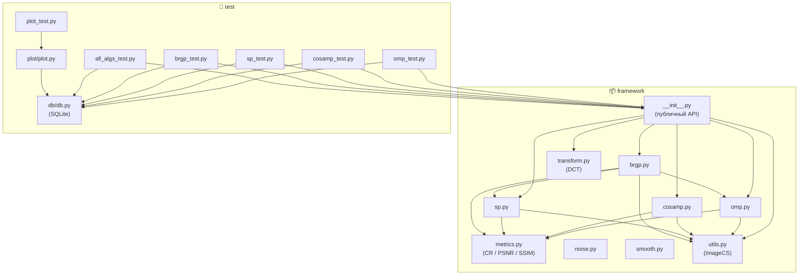
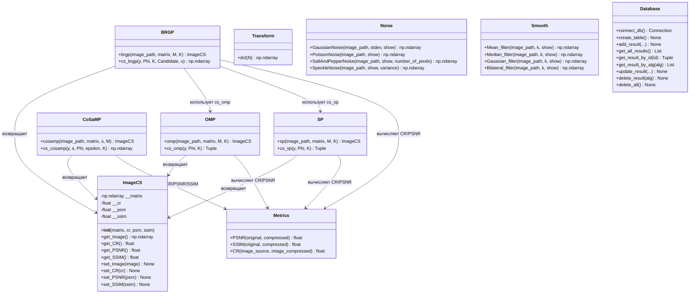
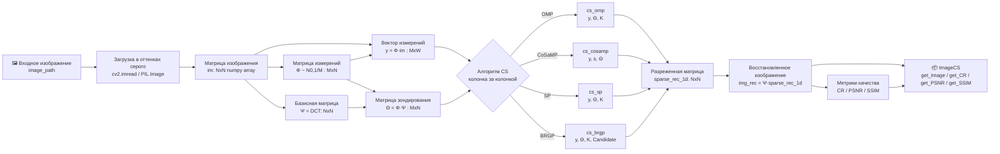
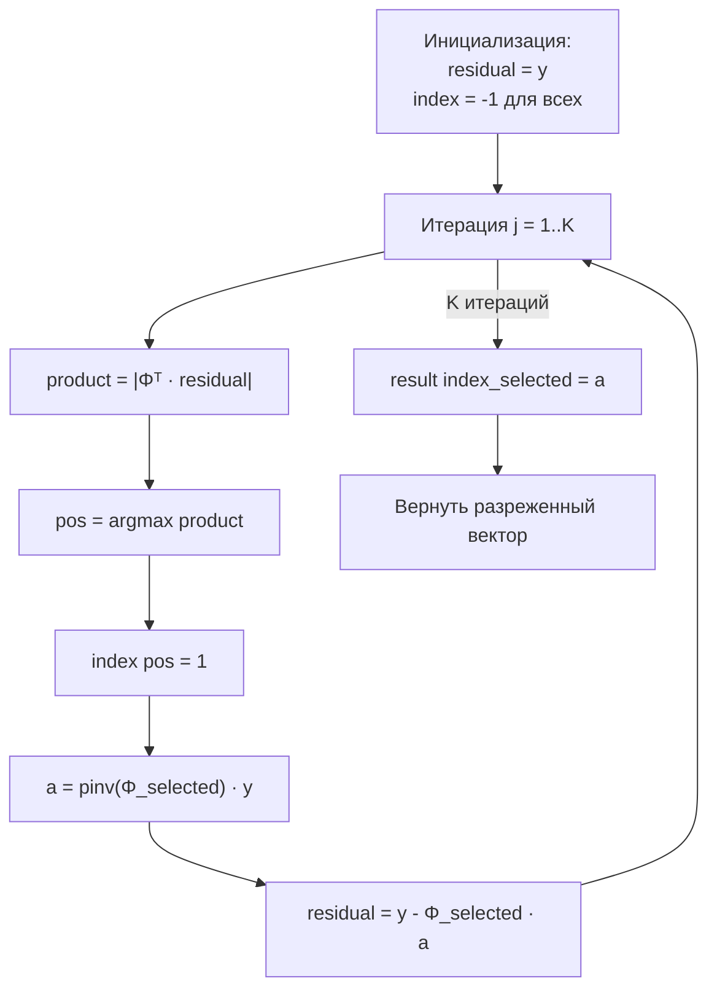
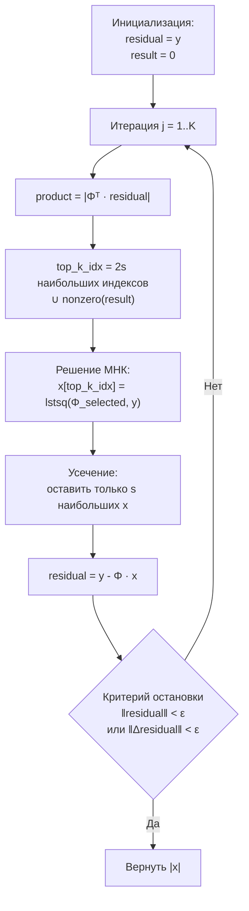
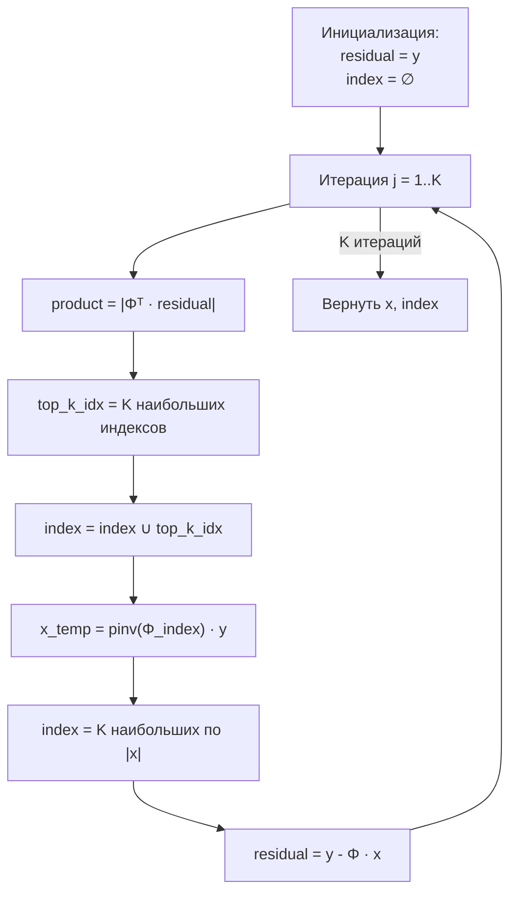
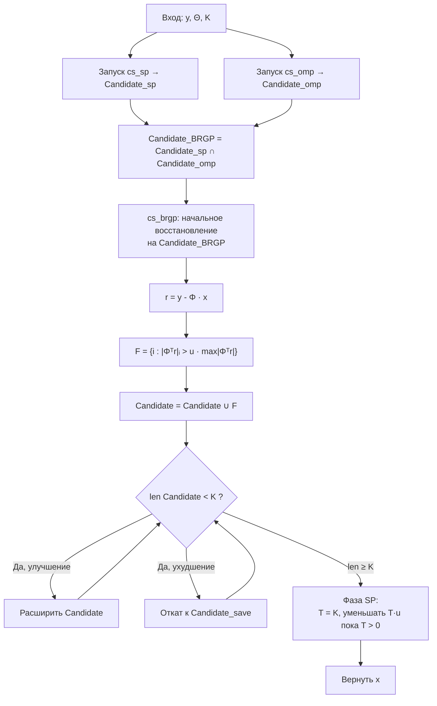
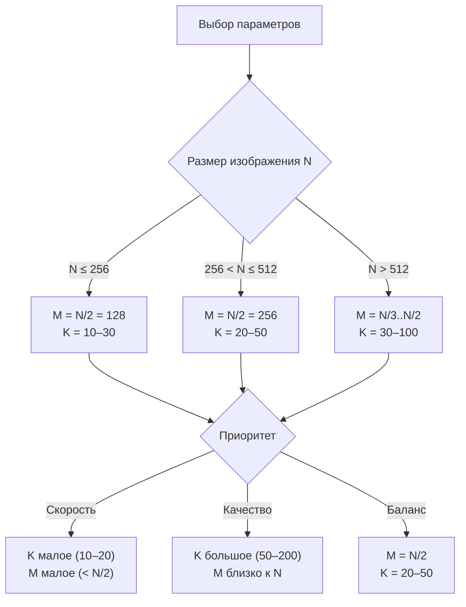

# Документация: Compressive Sensing Framework

## Содержание

1. [Обзор проекта](#обзор-проекта)
2. [Теоретическая основа](#теоретическая-основа)
3. [Архитектура фреймворка](#архитектура-фреймворка)
   - [Структура модулей](#структура-модулей)
   - [Диаграмма классов](#диаграмма-классов)
   - [Поток данных](#поток-данных)
4. [Компоненты фреймворка](#компоненты-фреймворка)
   - [Алгоритмы восстановления](#алгоритмы-восстановления)
   - [Преобразования](#преобразования)
   - [Метрики качества](#метрики-качества)
   - [Шумовые функции](#шумовые-функции)
   - [Фильтры сглаживания](#фильтры-сглаживания)
   - [Класс ImageCS](#класс-imagecs)
5. [Тестовая инфраструктура](#тестовая-инфраструктура)
6. [Руководство по интеграции](#руководство-по-интеграции)
7. [Масштабирование](#масштабирование)
8. [API Reference](#api-reference)

---

## Обзор проекта

**Compressive Sensing Framework** — это Python-фреймворк для сжатия и восстановления 2D изображений методами компрессивного зондирования (Compressive Sensing, CS). Фреймворк реализует несколько алгоритмов разреженного восстановления сигнала, инструменты оценки качества результатов, средства добавления шума и фильтрации изображений.

### Ключевые возможности

- Реализация алгоритмов CS: **OMP**, **CoSaMP**, **SP**, **BRGP**
- Преобразование Дискретного Косинусного Преобразования (DCT) как базисная матрица
- Метрики качества: **CR** (Compression Ratio), **PSNR**, **SSIM**
- Добавление шума: Gaussian, Poisson, Salt-and-Pepper, Speckle
- Фильтры сглаживания: Mean, Median, Gaussian, Bilateral
- Сохранение результатов тестирования в SQLite базу данных
- Визуализация результатов через Matplotlib

---

## Теоретическая основа

Компрессивное зондирование (CS) позволяет восстанавливать разреженный сигнал из числа измерений, значительно меньшего, чем требует теорема Найквиста–Шеннона.

### Математическая модель

Пусть `x ∈ ℝᴺ` — разреженный сигнал (изображение в базисе `Ψ`). Измеренный вектор:

```
y = Φ · Ψ · s = Θ · s
```

где:
- `Φ ∈ ℝᴹˣᴺ` — матрица измерений (`M << N`)
- `Ψ ∈ ℝᴺˣᴺ` — базисная матрица (DCT)
- `s ∈ ℝᴺ` — разреженный вектор коэффициентов
- `Θ = Φ · Ψ` — матрица зондирования

Задача восстановления: найти `s` такое, что `‖s‖₀` минимально при условии `Θ·s ≈ y`.

### Схема обработки изображения

```
┌─────────────────────────────────────────────────────────────────────┐
│                    Compressive Sensing Pipeline                      │
│                                                                       │
│  Изображение → Матрица Φ → y = Φ·x → Алгоритм CS → x̂ → Ψ·x̂       │
│  (NxN)          (MxN)        (MxN)    восстановление   (NxN)         │
└─────────────────────────────────────────────────────────────────────┘
```

---

## Архитектура фреймворка

### Структура модулей

```
compressive-sensing/
├── framework/                  # Основной пакет фреймворка
│   ├── __init__.py             # Экспорт публичного API
│   ├── omp.py                  # Алгоритм OMP
│   ├── cosamp.py               # Алгоритм CoSaMP
│   ├── sp.py                   # Алгоритм SP (Subspace Pursuit)
│   ├── brgp.py                 # Алгоритм BRGP
│   ├── transform.py            # DCT-преобразование
│   ├── metrics.py              # Метрики качества (CR, PSNR, SSIM)
│   ├── noise.py                # Функции добавления шума
│   ├── smooth.py               # Фильтры сглаживания
│   └── utils.py                # Вспомогательный класс ImageCS
├── test/                       # Тестовые скрипты
│   ├── omp_test.py             # Тест OMP
│   ├── cosamp_test.py          # Тест CoSaMP
│   ├── sp_test.py              # Тест SP
│   ├── brgp_test.py            # Тест BRGP
│   ├── all_algs_test.py        # Комплексный тест всех алгоритмов
│   ├── plot_test.py            # Визуализация результатов
│   ├── db/                     # Модуль работы с БД
│   │   ├── __init__.py
│   │   ├── db.py               # CRUD-операции SQLite
│   │   └── create_db.sql       # SQL-схема
│   └── plot/                   # Модуль визуализации
│       ├── __init__.py
│       └── plot.py             # Построение графиков
├── misc/                       # Набор тестовых изображений
├── requirements.txt            # Зависимости Python
├── setup.sh                    # Скрипт установки (Linux)
└── README.md                   # Краткое описание проекта
```

### Диаграмма модулей (зависимости)



### Диаграмма классов



### Поток данных



---

## Компоненты фреймворка

### Алгоритмы восстановления

Все алгоритмы работают с 2D-изображениями, обрабатывая изображение **колонка за колонкой** (column-by-column approach): каждый столбец пикселей восстанавливается независимо как одномерная задача CS.

#### OMP — Orthogonal Matching Pursuit

**Файл:** `framework/omp.py`  
**Автор:** Vladislav Gerda

**Описание:** OMP — жадный алгоритм, последовательно выбирающий наиболее коррелированные столбцы матрицы зондирования с текущим остатком, а затем проецирует измеренный сигнал на выбранное подпространство.

**Принцип работы:**



**Параметры:**

| Параметр | Тип | Описание |
|----------|-----|----------|
| `image_path` | `str` | Путь к изображению |
| `matrix` | `np.ndarray` | Базисная матрица NxN (DCT) |
| `M` | `int` | Размер матрицы измерений (M < N) |
| `K` | `int` | Количество итераций (= sparsity) |

**Сложность:** O(K · M · N) на один столбец.

---

#### CoSaMP — Compressive Sampling Matching Pursuit

**Файл:** `framework/cosamp.py`  
**Автор:** Vladislav Gerda

**Описание:** CoSaMP расширяет идею OMP, выбирая на каждом шаге `2s` лучших кандидатов, объединяя их с текущим поддержанием, решая задачу наименьших квадратов и усекая до `s` наибольших компонент. Алгоритм итерирует до сходимости.

**Принцип работы:**



**Параметры:**

| Параметр | Тип | Описание |
|----------|-----|----------|
| `image_path` | `str` | Путь к изображению |
| `matrix` | `np.ndarray` | Базисная матрица NxN (DCT) |
| `s` | `int` | Разреженность сигнала (sparsity) |
| `M` | `int` | Размер матрицы измерений |
| `epsilon` | `float` | Допустимая погрешность (по умолчанию 1e-10) |
| `K` | `int` | Максимальное число итераций (по умолчанию 1000) |

---

#### SP — Subspace Pursuit

**Файл:** `framework/sp.py`  
**Автор:** Grigory Demchenko

**Описание:** SP поддерживает фиксированный набор поддержания размера `K` на каждой итерации: расширяет набор на `K` новых кандидатов, решает ограниченную LS-задачу и оставляет `K` наибольших компонент.

**Принцип работы:**



**Параметры:**

| Параметр | Тип | Описание |
|----------|-----|----------|
| `image_path` | `str` | Путь к изображению |
| `matrix` | `np.ndarray` | Базисная матрица NxN (DCT) |
| `M` | `int` | Размер матрицы измерений |
| `K` | `int` | Количество итераций и размер поддержания |

---

#### BRGP — Backtracking Refined Greedy Pursuit

**Файл:** `framework/brgp.py`  
**Автор:** Grigory Demchenko

**Описание:** BRGP — гибридный алгоритм, использующий пересечение кандидатных множеств SP и OMP как начальное приближение, а затем итеративно уточняющий поддержание с механизмом отката (backtracking). Обеспечивает лучшее качество восстановления по сравнению с OMP и SP по отдельности.

**Принцип работы:**



**Параметры:**

| Параметр | Тип | Описание |
|----------|-----|----------|
| `image_path` | `str` | Путь к изображению |
| `matrix` | `np.ndarray` | Базисная матрица NxN (DCT) |
| `M` | `int` | Размер матрицы измерений |
| `K` | `int` | Количество итераций |
| `u` | `float` | Коэффициент отката (0 < u < 1, по умолчанию 0.8) |

---

### Сравнение алгоритмов

| Характеристика | OMP | CoSaMP | SP | BRGP |
|----------------|-----|--------|----|------|
| Тип | Жадный | Итеративный | Итеративный | Гибридный |
| Гарантия сходимости | Нет | Да | Да | Частичная |
| Число итераций | Фикс. K | До сходимости | Фикс. K | Адаптивное |
| Использует другие алгоритмы | Нет | Нет | Нет | OMP + SP |
| Метрики | CR, PSNR | CR, PSNR, SSIM | CR, PSNR | CR, PSNR |
| Вычислительная сложность | Средняя | Высокая | Средняя | Высокая |

---

### Преобразования

#### DCT — Discrete Cosine Transform

**Файл:** `framework/transform.py`

```python
def dct(N: int) -> np.ndarray
```

Генерирует ортонормированную матрицу DCT размером `NxN`. Используется как базисная матрица `Ψ` для представления изображений в разреженном виде — изображения, как правило, имеют малое число ненулевых DCT-коэффициентов.

**Формула k-го столбца:**

```
ψₖ[n] = cos(n · k·π/N),  n = 0..N-1
ψₖ = (ψₖ - mean(ψₖ)) / ‖ψₖ‖  (для k > 0)
```

**Пример использования:**

```python
from framework import dct
Psi = dct(256)  # Базисная матрица 256x256
```

---

### Метрики качества

**Файл:** `framework/metrics.py`

#### CR — Compression Ratio (Коэффициент сжатия)

```python
def CR(image_source: np.ndarray, image_compressed: np.ndarray) -> float
```

Отношение числа ненулевых элементов оригинального изображения к числу ненулевых элементов разреженного представления.

```
CR = count(nonzero(x)) / count(nonzero(sparse_x))
```

> **Примечание:** CR > 1 означает, что разреженное представление содержит меньше ненулевых элементов, т. е. сигнал действительно разреженный.

#### PSNR — Peak Signal-to-Noise Ratio

```python
def PSNR(original: np.ndarray, compressed: np.ndarray) -> float
```

Пиковое отношение сигнал/шум в дБ. Использует `skimage.metrics.peak_signal_noise_ratio`. Чем выше значение, тем лучше качество восстановления. Значения > 30 дБ считаются приемлемыми.

#### SSIM — Structural Similarity Index

```python
def SSIM(original: np.ndarray, compressed: np.ndarray) -> float
```

Индекс структурного сходства (0–1). Использует `skimage.metrics.structural_similarity`. Значения, близкие к 1, указывают на высокое структурное сходство с оригиналом.

---

### Шумовые функции

**Файл:** `framework/noise.py`

| Функция | Описание | Параметры |
|---------|----------|-----------|
| `GaussianNoise(image_path, stdev, show)` | Гауссово размытие (`cv2.GaussianBlur`) | `stdev` — размер ядра размытия (нечётное целое: 3, 5, 7, …) |
| `PoissonNoise(image_path, show)` | Пуассоновский шум | — |
| `SaltAndPepperNoise(image_path, show, number_of_pixels)` | Шум "соль и перец" | `number_of_pixels` — кол-во зашумляемых пикселей |
| `SpeckleNoise(image_path, show, variance)` | Мультипликативный шум | `variance` — дисперсия шума |

Все функции принимают `show: bool = True` для вывода сравнения оригинала и зашумлённого изображения через Matplotlib.

---

### Фильтры сглаживания

**Файл:** `framework/smooth.py`

| Функция | Описание | Параметры |
|---------|----------|-----------|
| `Mean_filter(image_path, k, show)` | Усредняющий фильтр | `k` — размер ядра (кxк) |
| `Median_filter(image_path, k, show)` | Медианный фильтр | `k` — размер ядра |
| `Gaussian_filter(image_path, k, show)` | Гауссов фильтр | `k` — размер ядра (нечётное) |
| `Bilateral_filter(image_path, k, show)` | Билатеральный фильтр | `k` — диаметр пикселей |

---

### Класс ImageCS

**Файл:** `framework/utils.py`

Контейнер для хранения результата работы алгоритма CS: восстановленного изображения и метрик качества.

```python
class ImageCS:
    def __init__(self, matrix: np.ndarray, cr: float = 0.0,
                 psnr: float = 0.0, ssim: float = 0.0)

    def get_Image(self) -> np.ndarray   # Данные изображения
    def get_CR(self) -> float           # Коэффициент сжатия
    def get_PSNR(self) -> float         # PSNR в дБ
    def get_SSIM(self) -> float         # SSIM (0–1)

    def set_Image(self, image: np.ndarray) -> None
    def set_CR(self, cr: float) -> None
    def set_PSNR(self, psnr: float) -> None
    def set_SSIM(self, ssim: float) -> None
```

---

## Тестовая инфраструктура

### Структура тестов

Тестовые скрипты расположены в директории `test/` и должны запускаться **из этой директории**.

```
test/
├── omp_test.py       # Тест OMP: перебор M и K, сохранение изображений и метрик
├── cosamp_test.py    # Тест CoSaMP
├── sp_test.py        # Тест SP
├── brgp_test.py      # Тест BRGP
├── all_algs_test.py  # Параллельный тест всех алгоритмов (threading)
├── plot_test.py      # Построение графиков из БД
├── db/               # Модуль SQLite
└── plot/             # Модуль визуализации
```

### База данных (SQLite)

**Файл:** `test/db/db.py`

Схема таблицы `results`:

```sql
CREATE TABLE IF NOT EXISTS results (
    id             INTEGER PRIMARY KEY AUTOINCREMENT,
    original_image TEXT    NOT NULL,   -- имя исходного изображения
    pwd            TEXT    NOT NULL,   -- путь к восстановленному изображению
    algorithm      TEXT    NOT NULL,   -- название алгоритма
    PSNR           FLOAT,              -- метрика PSNR
    SSIM           FLOAT,              -- метрика SSIM
    CR             FLOAT,              -- коэффициент сжатия
    K              INTEGER NOT NULL,   -- количество итераций
    M              INTEGER NOT NULL,   -- размер матрицы измерений
    height         INTEGER NOT NULL,   -- высота изображения
    width          INTEGER NOT NULL    -- ширина изображения
);
```

### Запуск тестов

```bash
cd test/

# Тест одного алгоритма
python omp_test.py

# Комплексный тест всех алгоритмов (параллельно)
python all_algs_test.py

# Визуализация результатов из БД
python plot_test.py
```

---

## Руководство по интеграции

### Установка

**Linux:**
```bash
git clone <repo_url>
cd compressive-sensing
./setup.sh
```

**Windows:**
```cmd
python -m venv venv
venv\Scripts\activate
pip install -r requirements.txt
```

### Базовое использование

```python
import sys
sys.path.insert(0, '/path/to/compressive-sensing')

from framework import omp, cosamp, sp, brgp, dct

# 1. Создать базисную матрицу DCT нужного размера
#    (N = высота/ширина изображения)
N = 256
Psi = dct(N)

# 2. Выбрать параметры алгоритма
M = 128   # Число измерений (M < N, рекомендуется M ~ N/2)
K = 20    # Итерации / sparsity

# 3. Запустить алгоритм
result = omp("misc/lena.png", Psi, M, K)

# 4. Получить результаты
import cv2
cv2.imwrite("output.png", result.get_Image())
print(f"CR:   {result.get_CR():.3f}")
print(f"PSNR: {result.get_PSNR():.2f} dB")
```

### Пример: обработка нескольких алгоритмов

```python
from framework import omp, cosamp, sp, brgp, dct
import cv2

image_path = "misc/lena.png"
N = 256
Psi = dct(N)
M = 128
K = 20

algorithms = {
    "OMP":    lambda: omp(image_path, Psi, M, K),
    "SP":     lambda: sp(image_path, Psi, M, K),
    "BRGP":   lambda: brgp(image_path, Psi, M, K),
    "CoSaMP": lambda: cosamp(image_path, Psi, K, M),  # s=K для CoSaMP
}

for name, alg_fn in algorithms.items():
    result = alg_fn()
    cv2.imwrite(f"output_{name.lower()}.png", result.get_Image())
    print(f"{name}: CR={result.get_CR():.3f}, PSNR={result.get_PSNR():.2f} dB")
```

### Пример: предобработка шумом и фильтрацией

```python
import cv2
import numpy as np
from framework.noise import GaussianNoise
from framework.smooth import Median_filter
from framework import omp, dct

# Добавить шум
noisy = GaussianNoise("misc/lena.png", stdev=5, show=False)
cv2.imwrite("/tmp/noisy.png", noisy)

# Применить фильтр
filtered = Median_filter("/tmp/noisy.png", k=3, show=False)
cv2.imwrite("/tmp/filtered.png", filtered)

# Применить CS к отфильтрованному изображению
result = omp("/tmp/filtered.png", dct(256), M=128, K=20)
print(f"PSNR после шума+фильтрации+CS: {result.get_PSNR():.2f} dB")
```

### Пример: использование метрик напрямую

```python
import cv2
import numpy as np
import framework.metrics as metrics

original = cv2.imread("misc/lena.png", cv2.IMREAD_GRAYSCALE)
compressed = cv2.imread("output.png", cv2.IMREAD_GRAYSCALE)

psnr_val = metrics.PSNR(original, compressed)
ssim_val = metrics.SSIM(original, compressed)
cr_val   = metrics.CR(original, compressed)

print(f"PSNR: {psnr_val:.2f} dB")
print(f"SSIM: {ssim_val:.4f}")
print(f"CR:   {cr_val:.3f}")
```

### Пример: сохранение результатов в БД (из директории test/)

```python
import sys
sys.path.insert(0, '/path/to/compressive-sensing/test')
import db

db.create_table()
db.add_result(
    pwd="output_omp.png",
    original_image="lena",
    algorithm="OMP",
    psnr=32.5,
    ssim=0.91,
    cr=1.75,
    k=20,
    m=128,
    height=256,
    width=256
)
results = db.get_all_results()
```

---

## Масштабирование

### Текущие ограничения

| Ограничение | Описание |
|-------------|----------|
| Изображения предполагаются квадратными | Все алгоритмы устанавливают `N = H` (высота изображения). Прямоугольные изображения (`H ≠ W`) обрабатываются корректно, если передать `dct(H)`: матрица Φ формируется по высоте, а цикл `for i in range(W)` проходит по всем столбцам. Необходимо явно передавать `dct(H)`, а не `dct(W)`. |
| Только оттенки серого | Все алгоритмы работают с `IMREAD_GRAYSCALE` |
| Колоночная обработка | Каждая колонка обрабатывается последовательно (цикл `for i in range(W)`) |
| Нет GPU-ускорения | Все вычисления выполняются на CPU через NumPy |

### Горизонтальное масштабирование

#### 1. Параллелизация на уровне колонок

Текущий подход обрабатывает колонки последовательно. Его можно легко распараллелить:

```python
from concurrent.futures import ThreadPoolExecutor
import numpy as np

def process_column(i, y_col, Theta, K):
    y = np.reshape(y_col, (-1, 1))
    col_rec, _ = cs_omp(y, Theta, K)
    return i, np.reshape(col_rec, (-1,))

# Параллельная обработка колонок
with ThreadPoolExecutor(max_workers=8) as executor:
    futures = [
        executor.submit(process_column, i, img_cs_1d[:, i], Theta_1d, K)
        for i in range(W)
    ]
    for future in futures:
        i, col = future.result()
        sparse_rec_1d[:, i] = col
```

#### 2. Параллелизация на уровне изображений

Для батчевой обработки нескольких изображений используйте `threading` (как в `all_algs_test.py`) или `multiprocessing`:

```python
from multiprocessing import Pool
from framework import omp, dct

def process_image(args):
    image_path, M, K = args
    return omp(image_path, dct(256), M, K)

images = ["misc/lena.png", "misc/house.png", "misc/4.1.05.png"]
params = [(img, 128, 20) for img in images]

with Pool(processes=4) as pool:
    results = pool.map(process_image, params)
```

#### 3. GPU-ускорение через CuPy

NumPy-операции можно перенести на GPU с минимальными изменениями:

```python
import cupy as cp   # pip install cupy-cuda12x
import numpy as np

# Заменить np.dot → cp.dot, np.linalg → cp.linalg
Phi_gpu = cp.array(Phi)
matrix_gpu = cp.array(matrix)
img_gpu = cp.array(im)

img_cs_1d = cp.dot(Phi_gpu, img_gpu)
Theta_1d = cp.dot(Phi_gpu, matrix_gpu)
# ... далее алгоритм на GPU
result_np = cp.asnumpy(sparse_rec_1d)
```

### Вертикальное масштабирование

#### 1. Поддержка цветных изображений

Расширение на цветные изображения (RGB) путём обработки каждого канала независимо:

```python
def omp_color(image_path: str, matrix: np.ndarray, M: int, K: int) -> np.ndarray:
    image = cv2.imread(image_path)  # BGR
    channels = cv2.split(image)
    rec_channels = []
    for ch in channels:
        # Сохранить канал во временный файл или передать как ndarray
        result = _omp_channel(ch, matrix, M, K)
        rec_channels.append(result)
    return cv2.merge(rec_channels)
```

#### 2. Поддержка прямоугольных изображений

Для прямоугольных изображений `(H, W)` при `H ≠ W` требуется применение DCT отдельно для строк и столбцов (2D DCT) или обработка с двумя разными матрицами:

```python
# Вариант: применить алгоритм к транспонированной матрице
# для обработки строк, затем колонок
```

#### 3. Адаптивная матрица измерений

Вместо случайной гауссовой матрицы Φ можно использовать детерминированные матрицы (Hadamard, Toeplitz) для воспроизводимости:

```python
from scipy.linalg import hadamard

N = 256
H = hadamard(N)
Phi = H[:M, :] / np.sqrt(M)  # Первые M строк матрицы Hadamard
```

### Добавление нового алгоритма

Фреймворк спроектирован для простого расширения. Для добавления нового алгоритма:

**1. Создайте файл** `framework/my_algorithm.py`:

```python
import numpy as np
import cv2
import framework.metrics as metrics
from framework.utils import ImageCS
from typing import Tuple

def my_algorithm(image_path: str, matrix: np.ndarray, M: int, K: int) -> ImageCS:
    """
    Описание алгоритма.
        image_path - путь к изображению.
        matrix     - базисная матрица NxN.
        M          - размер матрицы измерений.
        K          - число итераций.
    """
    image = cv2.imread(image_path, cv2.IMREAD_GRAYSCALE)
    H, W = image.shape
    N = H

    im = np.array(image)
    Phi = np.random.randn(M, N) / np.sqrt(M)
    img_cs_1d = np.dot(Phi, im)
    Theta_1d = np.dot(Phi, matrix)
    sparse_rec_1d = np.zeros((N, W))

    for i in range(W):
        y = np.reshape(img_cs_1d[:, i], (M, 1))
        column_rec = _cs_my_algorithm(y, Theta_1d, K)
        sparse_rec_1d[:, i] = np.reshape(column_rec, (N,))

    img_rec = np.dot(matrix, sparse_rec_1d)

    CR   = metrics.CR(image, sparse_rec_1d)
    PSNR = metrics.PSNR(image, img_rec)

    return ImageCS(img_rec, cr=CR, psnr=PSNR)


def _cs_my_algorithm(y: np.ndarray, Phi: np.ndarray, K: int) -> np.ndarray:
    """Реализация алгоритма для одного столбца."""
    # ... ваша реализация ...
    pass
```

**2. Зарегистрируйте** в `framework/__init__.py`:

```python
from .my_algorithm import my_algorithm
```

**3. Добавьте тестовый скрипт** `test/my_algorithm_test.py` по образцу существующих тестов.

---

### Рекомендации по выбору параметров



| Параметр | Рекомендуемый диапазон | Влияние |
|----------|----------------------|---------|
| `M` | `N/4` – `N` | ↑M → ↑PSNR, ↑время |
| `K` (OMP/SP/BRGP) | `10` – `200` | ↑K → ↑PSNR (до насыщения), ↑время |
| `s` (CoSaMP) | `5` – `50` | Разреженность сигнала |
| `u` (BRGP) | `0.6` – `0.9` | Агрессивность расширения |

---

## API Reference

### `framework` (публичный API)

```python
from framework import omp, cosamp, sp, brgp, dct, ImageCS
```

#### `omp(image_path, matrix, M, K) → ImageCS`
Восстановление изображения методом Orthogonal Matching Pursuit.

#### `cosamp(image_path, matrix, s, M) → ImageCS`
Восстановление изображения методом Compressive Sampling Matching Pursuit.

#### `sp(image_path, matrix, M, K) → ImageCS`
Восстановление изображения методом Subspace Pursuit.

#### `brgp(image_path, matrix, M, K) → ImageCS`
Восстановление изображения методом Backtracking Refined Greedy Pursuit.

#### `dct(N) → np.ndarray`
Создание ортонормированной DCT-матрицы размером NxN.

---

### `framework.metrics`

```python
import framework.metrics as metrics
```

#### `metrics.PSNR(original, compressed) → float`
#### `metrics.SSIM(original, compressed) → float`
#### `metrics.CR(image_source, image_compressed) → float`

---

### `framework.noise`

```python
from framework.noise import GaussianNoise, PoissonNoise, SaltAndPepperNoise, SpeckleNoise
```

#### `GaussianNoise(image_path, stdev=5, show=True) → np.ndarray`
#### `PoissonNoise(image_path, show=True) → np.ndarray`
#### `SaltAndPepperNoise(image_path, show=True, number_of_pixels=1000) → np.ndarray`
#### `SpeckleNoise(image_path, show=True, variance=0.1) → np.ndarray`

---

### `framework.smooth`

```python
from framework.smooth import Mean_filter, Median_filter, Gaussian_filter, Bilateral_filter
```

#### `Mean_filter(image_path, k, show=True) → np.ndarray`
#### `Median_filter(image_path, k, show=True) → np.ndarray`
#### `Gaussian_filter(image_path, k, show=True) → np.ndarray`
#### `Bilateral_filter(image_path, k, show=True) → np.ndarray`

---

### `test/db`

```python
import db  # из директории test/
```

#### `db.create_table() → None`
#### `db.add_result(pwd, original_image, algorithm, psnr, ssim, cr, k, m, height, width) → None`
#### `db.get_all_results() → List[Tuple]`
#### `db.get_result_by_id(result_id) → Optional[Tuple]`
#### `db.get_result_by_alg(alg) → List[Tuple]`
#### `db.delete_result(result_alg) → None`
#### `db.delete_all() → None`

---

## Авторы

| Автор | GitHub | Компоненты |
|-------|--------|------------|
| Герда Владислав | [@hitfot](https://github.com/hitfot) | OMP, CoSaMP, DCT, Metrics, Noise |
| Демченко Григорий | [@Pumukun](https://github.com/Pumukun) | SP, BRGP, ImageCS |
| Кочерыгина Анастасия | [@somniiium](https://github.com/somniiium) | — |
| Сабитова Алина | [@AlinaSAB](https://github.com/AlinaSAB) | — |
| Шибанов Михаил | [@Kar1ch](https://github.com/Kar1ch) | Database (db.py) |
