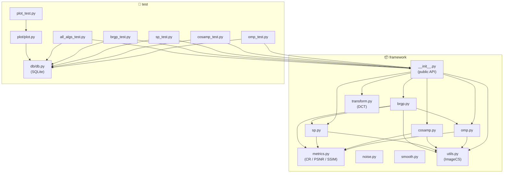
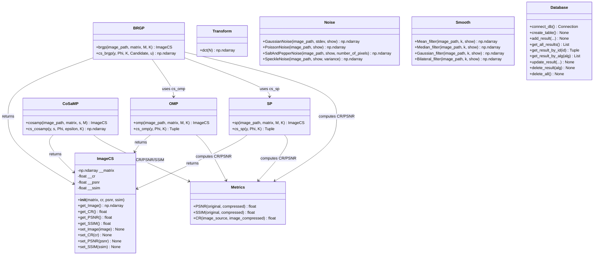
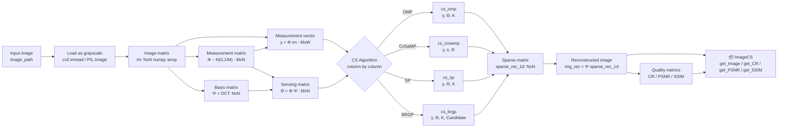

# Compressive Sensing Framework — Documentation

## Table of Contents

1. [Project Overview](#project-overview)
2. [Theoretical Background](#theoretical-background)
3. [Framework Architecture](#framework-architecture)
   - [Module Structure](#module-structure)
   - [Class Diagram](#class-diagram)
   - [Data Flow](#data-flow)
4. [Framework Components](#framework-components)
   - [Recovery Algorithms](#recovery-algorithms)
   - [Transforms](#transforms)
   - [Quality Metrics](#quality-metrics)
   - [Noise Functions](#noise-functions)
   - [Smoothing Filters](#smoothing-filters)
   - [ImageCS Class](#imagecs-class)
5. [Testing Infrastructure](#testing-infrastructure)
6. [Integration Guide](#integration-guide)
7. [Scaling](#scaling)
8. [API Reference](#api-reference)

---

## Project Overview

**Compressive Sensing Framework** is a Python framework for compression and reconstruction of 2D images using Compressive Sensing (CS) methods. The framework implements several sparse signal recovery algorithms along with quality assessment tools, noise generation utilities, and image smoothing filters.

### Key Features

- CS algorithm implementations: **OMP**, **CoSaMP**, **SP**, **BRGP**
- Discrete Cosine Transform (DCT) as the sparsifying basis matrix
- Quality metrics: **CR** (Compression Ratio), **PSNR**, **SSIM**
- Noise generation: Gaussian, Poisson, Salt-and-Pepper, Speckle
- Smoothing filters: Mean, Median, Gaussian, Bilateral
- Test result persistence in an SQLite database
- Result visualisation via Matplotlib

---

## Theoretical Background

Compressive Sensing allows a sparse signal to be recovered from far fewer measurements than the Nyquist–Shannon sampling theorem would require.

### Mathematical Model

Let `x ∈ ℝᴺ` be a sparse signal (an image represented in basis `Ψ`). The measurement vector is:

```
y = Φ · Ψ · s = Θ · s
```

where:
- `Φ ∈ ℝᴹˣᴺ` — measurement matrix (M is much smaller than N)
- `Ψ ∈ ℝᴺˣᴺ` — sparsifying basis matrix (DCT)
- `s ∈ ℝᴺ` — sparse coefficient vector
- `Θ = Φ · Ψ` — sensing matrix

Recovery problem: find `s` such that `‖s‖₀` is minimised subject to `Θ·s ≈ y`.

### Processing Pipeline

```
┌──────────────────────────────────────────────────────────────────────┐
│                    Compressive Sensing Pipeline                       │
│                                                                        │
│  Image  →  Matrix Φ  →  y = Φ·x  →  CS Algorithm  →  x̂  →  Ψ·x̂   │
│  (NxN)      (MxN)         (MxN)       recovery          (NxN)         │
└──────────────────────────────────────────────────────────────────────┘
```

---

## Framework Architecture

### Module Structure

```
compressive-sensing/
├── framework/                  # Main framework package
│   ├── __init__.py             # Public API exports
│   ├── omp.py                  # OMP algorithm
│   ├── cosamp.py               # CoSaMP algorithm
│   ├── sp.py                   # SP (Subspace Pursuit) algorithm
│   ├── brgp.py                 # BRGP algorithm
│   ├── transform.py            # DCT transform
│   ├── metrics.py              # Quality metrics (CR, PSNR, SSIM)
│   ├── noise.py                # Noise generation functions
│   ├── smooth.py               # Smoothing filters
│   └── utils.py                # ImageCS helper class
├── test/                       # Test scripts
│   ├── omp_test.py             # OMP test
│   ├── cosamp_test.py          # CoSaMP test
│   ├── sp_test.py              # SP test
│   ├── brgp_test.py            # BRGP test
│   ├── all_algs_test.py        # Combined test of all algorithms
│   ├── plot_test.py            # Result visualisation
│   ├── db/                     # Database module
│   │   ├── __init__.py
│   │   ├── db.py               # SQLite CRUD operations
│   │   └── create_db.sql       # SQL schema
│   └── plot/                   # Plotting module
│       ├── __init__.py
│       └── plot.py             # Chart generation
├── misc/                       # Sample test images
├── requirements.txt            # Python dependencies
├── setup.sh                    # Linux setup script
└── README.md                   # Brief project description
```

### Module Dependency Diagram



### Class Diagram



### Data Flow



---

## Framework Components

### Recovery Algorithms

All algorithms work with 2D images using a **column-by-column** approach: each pixel column is recovered independently as a 1D CS problem.

#### OMP — Orthogonal Matching Pursuit

**File:** `framework/omp.py`  
**Author:** Vladislav Gerda

**Description:** OMP is a greedy algorithm that iteratively selects the column of the sensing matrix most correlated with the current residual, then projects the measured signal onto the selected subspace.

**Pseudocode:**

```
function cs_omp(y, Φ, K):
    residual ← y
    index    ← array of -1, length N        // support mask

    for j = 1 to K:
        product ← |Φᵀ · residual|           // correlation with each column
        pos     ← argmax(product)           // most correlated column
        index[pos] ← 1                      // add to support

        a        ← pinv(Φ[:, index≥0]) · y  // least-squares on support
        residual ← y − Φ[:, index≥0] · a   // update residual

    result[index≥0] ← a
    return result
```

**Parameters:**

| Parameter | Type | Description |
|-----------|------|-------------|
| `image_path` | `str` | Path to the input image |
| `matrix` | `np.ndarray` | Basis matrix NxN (DCT) |
| `M` | `int` | Number of measurements (M < N) |
| `K` | `int` | Number of iterations (= sparsity level) |

**Complexity:** O(K · M · N) per column.

---

#### CoSaMP — Compressive Sampling Matching Pursuit

**File:** `framework/cosamp.py`  
**Author:** Vladislav Gerda

**Description:** CoSaMP extends OMP by selecting `2s` best candidate indices at each step, merging them with the current support, solving a least-squares problem, and pruning back to the `s` largest components. The algorithm iterates until convergence.

**Pseudocode:**

```
function cs_cosamp(y, s, Φ, ε=1e-10, K=1000):
    residual ← y
    result   ← zeros(N)

    for j = 1 to K:
        product    ← |Φᵀ · residual|
        top_k_idx  ← indices of 2s largest values in product
        top_k_idx  ← top_k_idx ∪ nonzero(result)   // merge with current support

        x           ← zeros(N)
        x[top_k_idx] ← lstsq(Φ[:, top_k_idx], y)  // constrained least squares
        set all but the s largest-magnitude entries of x to 0

        result       ← x
        residual_old ← residual
        residual     ← y − Φ · result

        if ‖residual‖ < ε  or  ‖residual − residual_old‖ < ε:
            break

    return |result|
```

**Parameters:**

| Parameter | Type | Description |
|-----------|------|-------------|
| `image_path` | `str` | Path to the input image |
| `matrix` | `np.ndarray` | Basis matrix NxN (DCT) |
| `s` | `int` | Signal sparsity level |
| `M` | `int` | Number of measurements |
| `epsilon` | `float` | Convergence tolerance (default 1e-10) |
| `K` | `int` | Maximum number of iterations (default 1000) |

---

#### SP — Subspace Pursuit

**File:** `framework/sp.py`  
**Author:** Grigory Demchenko

**Description:** SP maintains a fixed support set of size `K` at every iteration: it expands the set with `K` new candidates, solves a constrained LS problem over the union, then retains only the `K` largest-magnitude components.

**Pseudocode:**

```
function cs_sp(y, Φ, K):
    residual ← y
    index    ← ∅                              // current support set
    x        ← zeros(N)

    for j = 1 to K:
        product    ← |Φᵀ · residual|
        top_k_idx  ← indices of K largest values in product
        index      ← index ∪ top_k_idx       // expand support

        x_temp     ← pinv(Φ[:, index]) · y  // least squares on support
        x[index]   ← x_temp

        index      ← indices of K largest values in |x|  // prune to K
        residual   ← y − Φ · x

    return x, index
```

**Parameters:**

| Parameter | Type | Description |
|-----------|------|-------------|
| `image_path` | `str` | Path to the input image |
| `matrix` | `np.ndarray` | Basis matrix NxN (DCT) |
| `M` | `int` | Number of measurements |
| `K` | `int` | Number of iterations and support set size |

---

#### BRGP — Backtracking Refined Greedy Pursuit

**File:** `framework/brgp.py`  
**Author:** Grigory Demchenko

**Description:** BRGP is a hybrid algorithm. It initialises the support as the intersection of the SP and OMP candidate sets, then iteratively refines the support with a backtracking mechanism (reverting to the last saved state when the residual worsens). A final SP-style refinement phase shrinks the support from size K down to 0.

**Pseudocode:**

```
function brgp(y, Φ, K, u=0.8):
    // --- Initialisation ---
    _, Candidate_sp  ← cs_sp(y, Φ, K)
    _, Candidate_omp ← cs_omp(y, Φ, K)
    Candidate        ← Candidate_sp ∩ Candidate_omp  // intersection as seed

    x        ← pinv(Φ[:, Candidate]) · y projected onto Candidate
    r        ← y − Φ · x
    r_save   ← r
    C_save   ← Candidate

    // --- Expansion phase ---
    F         ← { i : |Φᵀr|ᵢ > u · max|Φᵀr| }
    Candidate ← Candidate ∪ F
    x, r      ← recompute(Φ, Candidate, y)

    while len(Candidate) < K:
        if ‖r − r_save‖ < ‖y‖:              // improvement: expand
            C_save    ← Candidate
            r_save    ← r
            F         ← { i : |Φᵀr|ᵢ > u · max|Φᵀr| }
            Candidate ← Candidate ∪ F
        else:                                 // no improvement: backtrack
            Candidate ← C_save
            r         ← r_save
            C_dif     ← complement candidates not yet in Candidate
            F         ← argmax of pinv(Φ[:, C_dif]) · y
            Candidate ← Candidate ∪ F
        x, r ← recompute(Φ, Candidate, y)

    // --- SP-style refinement phase ---
    T ← K
    while T > 0:
        top_T     ← indices of T largest values in |Φᵀr|
        Candidate ← Candidate ∪ top_T
        keep_K    ← indices of K largest values in |pinv(Φ[:, Candidate]) · y|
        Candidate ← Candidate[keep_K]
        x, r      ← recompute(Φ, Candidate, y)
        T         ← floor(T · u)

    return x
```

**Parameters:**

| Parameter | Type | Description |
|-----------|------|-------------|
| `image_path` | `str` | Path to the input image |
| `matrix` | `np.ndarray` | Basis matrix NxN (DCT) |
| `M` | `int` | Number of measurements |
| `K` | `int` | Number of iterations |
| `u` | `float` | Backtracking coefficient (0 < u < 1, default 0.8) |

---

### Algorithm Comparison

| Property | OMP | CoSaMP | SP | BRGP |
|----------|-----|--------|----|------|
| Type | Greedy | Iterative | Iterative | Hybrid |
| Convergence guarantee | No | Yes | Yes | Partial |
| Iteration count | Fixed K | Until convergence | Fixed K | Adaptive |
| Uses other algorithms | No | No | No | OMP + SP |
| Available metrics | CR, PSNR | CR, PSNR, SSIM | CR, PSNR | CR, PSNR |
| Computational cost | Medium | High | Medium | High |

---

### Transforms

#### DCT — Discrete Cosine Transform

**File:** `framework/transform.py`

```python
def dct(N: int) -> np.ndarray
```

Generates an orthonormal DCT matrix of size `NxN`. Used as the sparsifying basis matrix `Ψ` — natural images typically have very few non-zero DCT coefficients.

**Formula for column k:**

```
ψₖ[n] = cos(n · k·π/N),  n = 0..N-1
ψₖ = (ψₖ − mean(ψₖ)) / ‖ψₖ‖   (for k > 0)
```

**Example:**

```python
from framework import dct
Psi = dct(256)  # 256x256 basis matrix
```

---

### Quality Metrics

**File:** `framework/metrics.py`

#### CR — Compression Ratio

```python
def CR(image_source: np.ndarray, image_compressed: np.ndarray) -> float
```

Ratio of the number of non-zero elements in the original image to the number of non-zero elements in its sparse representation.

```
CR = count(nonzero(x)) / count(nonzero(sparse_x))
```

> **Note:** CR > 1 means the sparse representation has fewer non-zero elements, i.e. the signal is genuinely sparse.

#### PSNR — Peak Signal-to-Noise Ratio

```python
def PSNR(original: np.ndarray, compressed: np.ndarray) -> float
```

Peak signal-to-noise ratio in dB. Uses `skimage.metrics.peak_signal_noise_ratio`. Higher values indicate better reconstruction quality; values > 30 dB are generally considered acceptable.

#### SSIM — Structural Similarity Index

```python
def SSIM(original: np.ndarray, compressed: np.ndarray) -> float
```

Structural Similarity Index (0–1). Uses `skimage.metrics.structural_similarity`. Values close to 1 indicate high structural fidelity to the original.

---

### Noise Functions

**File:** `framework/noise.py`

| Function | Description | Parameters |
|----------|-------------|------------|
| `GaussianNoise(image_path, stdev, show)` | Gaussian blur (`cv2.GaussianBlur`) | `stdev` — kernel size (odd integer: 3, 5, 7, …) |
| `PoissonNoise(image_path, show)` | Poisson noise | — |
| `SaltAndPepperNoise(image_path, show, number_of_pixels)` | Salt-and-pepper noise | `number_of_pixels` — number of corrupted pixels |
| `SpeckleNoise(image_path, show, variance)` | Speckle (multiplicative) noise | `variance` — noise variance |

All functions accept `show: bool = True` to display a side-by-side comparison of the original and noisy image via Matplotlib.

---

### Smoothing Filters

**File:** `framework/smooth.py`

| Function | Description | Parameters |
|----------|-------------|------------|
| `Mean_filter(image_path, k, show)` | Averaging filter | `k` — kernel size (k×k) |
| `Median_filter(image_path, k, show)` | Median filter | `k` — kernel size |
| `Gaussian_filter(image_path, k, show)` | Gaussian filter | `k` — kernel size (must be odd) |
| `Bilateral_filter(image_path, k, show)` | Bilateral filter | `k` — pixel neighbourhood diameter |

---

### ImageCS Class

**File:** `framework/utils.py`

A container that holds the result of a CS algorithm: the reconstructed image together with quality metrics.

```python
class ImageCS:
    def __init__(self, matrix: np.ndarray, cr: float = 0.0,
                 psnr: float = 0.0, ssim: float = 0.0)

    def get_Image(self) -> np.ndarray   # Image data
    def get_CR(self) -> float           # Compression ratio
    def get_PSNR(self) -> float         # PSNR in dB
    def get_SSIM(self) -> float         # SSIM (0–1)

    def set_Image(self, image: np.ndarray) -> None
    def set_CR(self, cr: float) -> None
    def set_PSNR(self, psnr: float) -> None
    def set_SSIM(self, ssim: float) -> None
```

---

## Testing Infrastructure

### Test Structure

Test scripts are located in the `test/` directory and must be **run from within that directory**.

```
test/
├── omp_test.py       # OMP test: sweeps M and K, saves images and metrics
├── cosamp_test.py    # CoSaMP test
├── sp_test.py        # SP test
├── brgp_test.py      # BRGP test
├── all_algs_test.py  # Parallel test of all algorithms (threading)
├── plot_test.py      # Plot results from DB
├── db/               # SQLite module
└── plot/             # Plotting module
```

### Database (SQLite)

**File:** `test/db/db.py`

Schema of the `results` table:

```sql
CREATE TABLE IF NOT EXISTS results (
    id             INTEGER PRIMARY KEY AUTOINCREMENT,
    original_image TEXT    NOT NULL,   -- source image name
    pwd            TEXT    NOT NULL,   -- path to reconstructed image
    algorithm      TEXT    NOT NULL,   -- algorithm name
    PSNR           FLOAT,              -- PSNR metric
    SSIM           FLOAT,              -- SSIM metric
    CR             FLOAT,              -- compression ratio
    K              INTEGER NOT NULL,   -- iteration count
    M              INTEGER NOT NULL,   -- measurement matrix size
    height         INTEGER NOT NULL,   -- image height
    width          INTEGER NOT NULL    -- image width
);
```

### Running Tests

```bash
cd test/

# Test a single algorithm
python omp_test.py

# Test all algorithms in parallel
python all_algs_test.py

# Plot results from the database
python plot_test.py
```

---

## Integration Guide

### Installation

**Linux:**
```bash
git clone <repo_url>
cd compressive-sensing
./setup.sh
```

**Windows:**
```cmd
python -m venv venv
venv\Scripts\activate
pip install -r requirements.txt
```

### Basic Usage

```python
import sys
sys.path.insert(0, '/path/to/compressive-sensing')

from framework import omp, cosamp, sp, brgp, dct

# 1. Build a DCT basis matrix matching the image size
#    (N = image height / width)
N = 256
Psi = dct(N)

# 2. Choose algorithm parameters
M = 128   # Number of measurements (M < N; M ≈ N/2 recommended)
K = 20    # Iterations / sparsity level

# 3. Run the algorithm
result = omp("misc/lena.png", Psi, M, K)

# 4. Retrieve results
import cv2
cv2.imwrite("output.png", result.get_Image())
print(f"CR:   {result.get_CR():.3f}")
print(f"PSNR: {result.get_PSNR():.2f} dB")
```

### Example: Multiple Algorithms

```python
from framework import omp, cosamp, sp, brgp, dct
import cv2

image_path = "misc/lena.png"
N = 256
Psi = dct(N)
M = 128
K = 20

algorithms = {
    "OMP":    lambda: omp(image_path, Psi, M, K),
    "SP":     lambda: sp(image_path, Psi, M, K),
    "BRGP":   lambda: brgp(image_path, Psi, M, K),
    "CoSaMP": lambda: cosamp(image_path, Psi, K, M),  # s=K for CoSaMP
}

for name, alg_fn in algorithms.items():
    result = alg_fn()
    cv2.imwrite(f"output_{name.lower()}.png", result.get_Image())
    print(f"{name}: CR={result.get_CR():.3f}, PSNR={result.get_PSNR():.2f} dB")
```

### Example: Noise and Filtering Pre-processing

```python
import cv2
import numpy as np
from framework.noise import GaussianNoise
from framework.smooth import Median_filter
from framework import omp, dct

# Add noise
noisy = GaussianNoise("misc/lena.png", stdev=5, show=False)
cv2.imwrite("/tmp/noisy.png", noisy)

# Apply filter
filtered = Median_filter("/tmp/noisy.png", k=3, show=False)
cv2.imwrite("/tmp/filtered.png", filtered)

# Apply CS to the filtered image
result = omp("/tmp/filtered.png", dct(256), M=128, K=20)
print(f"PSNR after noise + filter + CS: {result.get_PSNR():.2f} dB")
```

### Example: Using Metrics Directly

```python
import cv2
import numpy as np
import framework.metrics as metrics

original   = cv2.imread("misc/lena.png", cv2.IMREAD_GRAYSCALE)
compressed = cv2.imread("output.png",    cv2.IMREAD_GRAYSCALE)

psnr_val = metrics.PSNR(original, compressed)
ssim_val = metrics.SSIM(original, compressed)
cr_val   = metrics.CR(original, compressed)

print(f"PSNR: {psnr_val:.2f} dB")
print(f"SSIM: {ssim_val:.4f}")
print(f"CR:   {cr_val:.3f}")
```

### Example: Saving Results to the Database (run from `test/`)

```python
import sys
sys.path.insert(0, '/path/to/compressive-sensing/test')
import db

db.create_table()
db.add_result(
    pwd="output_omp.png",
    original_image="lena",
    algorithm="OMP",
    psnr=32.5,
    ssim=0.91,
    cr=1.75,
    k=20,
    m=128,
    height=256,
    width=256
)
results = db.get_all_results()
```

---

## Scaling

### Current Limitations

| Limitation | Description |
|------------|-------------|
| Images assumed square | All algorithms set `N = H` (image height); pass `dct(H)` for rectangular images. |
| Grayscale only | All algorithms load images with `IMREAD_GRAYSCALE`. |
| Sequential column processing | Each column is processed in a `for i in range(W)` loop. |
| No GPU acceleration | All computation runs on CPU via NumPy. |

> **Rectangular images:** Φ is built over the height dimension (`N = H`) and the loop `for i in range(W)` covers all columns regardless of width, so rectangular images work correctly. Always pass `dct(H)` rather than `dct(W)`.

### Horizontal Scaling

#### 1. Column-level Parallelism

The current sequential column loop can easily be parallelised:

```python
from concurrent.futures import ThreadPoolExecutor
import numpy as np

def process_column(i, y_col, Theta, K):
    y = np.reshape(y_col, (-1, 1))
    col_rec, _ = cs_omp(y, Theta, K)
    return i, np.reshape(col_rec, (-1,))

with ThreadPoolExecutor(max_workers=8) as executor:
    futures = [
        executor.submit(process_column, i, img_cs_1d[:, i], Theta_1d, K)
        for i in range(W)
    ]
    for future in futures:
        i, col = future.result()
        sparse_rec_1d[:, i] = col
```

#### 2. Image-level Parallelism

For batch processing of multiple images use `threading` (as in `all_algs_test.py`) or `multiprocessing`:

```python
from multiprocessing import Pool
from framework import omp, dct

def process_image(args):
    image_path, M, K = args
    return omp(image_path, dct(256), M, K)

images = ["misc/lena.png", "misc/house.png", "misc/4.1.05.png"]
params = [(img, 128, 20) for img in images]

with Pool(processes=4) as pool:
    results = pool.map(process_image, params)
```

#### 3. GPU Acceleration via CuPy

NumPy operations can be offloaded to a GPU with minimal code changes:

```python
import cupy as cp   # pip install cupy-cuda12x
import numpy as np

# Replace np.dot → cp.dot, np.linalg → cp.linalg
Phi_gpu    = cp.array(Phi)
matrix_gpu = cp.array(matrix)
img_gpu    = cp.array(im)

img_cs_1d = cp.dot(Phi_gpu, img_gpu)
Theta_1d  = cp.dot(Phi_gpu, matrix_gpu)
# ... rest of the algorithm on GPU ...
result_np = cp.asnumpy(sparse_rec_1d)
```

### Vertical Scaling

#### 1. Colour Image Support

Extend to colour (RGB) images by processing each channel independently:

```python
def omp_color(image_path: str, matrix: np.ndarray, M: int, K: int) -> np.ndarray:
    image = cv2.imread(image_path)  # BGR
    channels = cv2.split(image)
    rec_channels = []
    for ch in channels:
        # Save the channel to a temp file, or pass as ndarray directly
        result = _omp_channel(ch, matrix, M, K)
        rec_channels.append(result)
    return cv2.merge(rec_channels)
```

#### 2. Rectangular Image Support

For images where `H ≠ W`, apply 2D DCT separately along rows and columns, or pass two different matrices:

```python
# Option: run the algorithm on the transposed matrix
# to process rows, then columns.
```

#### 3. Deterministic Measurement Matrix

Replace the random Gaussian Φ with a deterministic matrix (Hadamard, Toeplitz) for reproducibility:

```python
from scipy.linalg import hadamard

N   = 256
H   = hadamard(N)
Phi = H[:M, :] / np.sqrt(M)  # First M rows of the Hadamard matrix
```

### Adding a New Algorithm

The framework is designed for easy extension. To add a new algorithm:

**Step 1.** Create `framework/my_algorithm.py`:

```python
import numpy as np
import cv2
import framework.metrics as metrics
from framework.utils import ImageCS
from typing import Tuple

def my_algorithm(image_path: str, matrix: np.ndarray, M: int, K: int) -> ImageCS:
    """
    Algorithm description.
        image_path - path to the image.
        matrix     - NxN basis matrix.
        M          - number of measurements.
        K          - number of iterations.
    """
    image = cv2.imread(image_path, cv2.IMREAD_GRAYSCALE)
    H, W = image.shape
    N = H

    im = np.array(image)
    Phi = np.random.randn(M, N) / np.sqrt(M)
    img_cs_1d = np.dot(Phi, im)
    Theta_1d = np.dot(Phi, matrix)
    sparse_rec_1d = np.zeros((N, W))

    for i in range(W):
        y = np.reshape(img_cs_1d[:, i], (M, 1))
        column_rec = _cs_my_algorithm(y, Theta_1d, K)
        sparse_rec_1d[:, i] = np.reshape(column_rec, (N,))

    img_rec = np.dot(matrix, sparse_rec_1d)

    CR   = metrics.CR(image, sparse_rec_1d)
    PSNR = metrics.PSNR(image, img_rec)

    return ImageCS(img_rec, cr=CR, psnr=PSNR)


def _cs_my_algorithm(y: np.ndarray, Phi: np.ndarray, K: int) -> np.ndarray:
    """Core algorithm for a single column."""
    # ... your implementation ...
    pass
```

**Step 2.** Register it in `framework/__init__.py`:

```python
from .my_algorithm import my_algorithm
```

**Step 3.** Add a test script `test/my_algorithm_test.py` following the pattern of the existing test files.

---

### Parameter Selection Guide

Use the following table to choose starting values for `M` and `K` based on image size and the speed/quality trade-off:

| Image size N | Recommended M | Recommended K | Priority |
|--------------|---------------|---------------|----------|
| N ≤ 256 | 128 (N/2) | 10–30 | — |
| 256 < N ≤ 512 | 256 (N/2) | 20–50 | — |
| N > 512 | N/3 – N/2 | 30–100 | — |
| Any | < N/2 | 10–20 | Speed |
| Any | ≈ N | 50–200 | Quality |
| Any | N/2 | 20–50 | Balanced |

| Parameter | Recommended range | Effect |
|-----------|-------------------|--------|
| `M` | `N/4` – `N` | ↑M → ↑PSNR, ↑time |
| `K` (OMP/SP/BRGP) | `10` – `200` | ↑K → ↑PSNR (up to saturation), ↑time |
| `s` (CoSaMP) | `5` – `50` | Signal sparsity |
| `u` (BRGP) | `0.6` – `0.9` | Expansion aggressiveness |

---

## API Reference

### `framework` (public API)

```python
from framework import omp, cosamp, sp, brgp, dct, ImageCS
```

#### `omp(image_path, matrix, M, K) → ImageCS`
Image reconstruction using Orthogonal Matching Pursuit.

#### `cosamp(image_path, matrix, s, M) → ImageCS`
Image reconstruction using Compressive Sampling Matching Pursuit.

#### `sp(image_path, matrix, M, K) → ImageCS`
Image reconstruction using Subspace Pursuit.

#### `brgp(image_path, matrix, M, K) → ImageCS`
Image reconstruction using Backtracking Refined Greedy Pursuit.

#### `dct(N) → np.ndarray`
Generate an orthonormal DCT matrix of size NxN.

---

### `framework.metrics`

```python
import framework.metrics as metrics
```

#### `metrics.PSNR(original, compressed) → float`
#### `metrics.SSIM(original, compressed) → float`
#### `metrics.CR(image_source, image_compressed) → float`

---

### `framework.noise`

```python
from framework.noise import GaussianNoise, PoissonNoise, SaltAndPepperNoise, SpeckleNoise
```

#### `GaussianNoise(image_path, stdev=5, show=True) → np.ndarray`
#### `PoissonNoise(image_path, show=True) → np.ndarray`
#### `SaltAndPepperNoise(image_path, show=True, number_of_pixels=1000) → np.ndarray`
#### `SpeckleNoise(image_path, show=True, variance=0.1) → np.ndarray`

---

### `framework.smooth`

```python
from framework.smooth import Mean_filter, Median_filter, Gaussian_filter, Bilateral_filter
```

#### `Mean_filter(image_path, k, show=True) → np.ndarray`
#### `Median_filter(image_path, k, show=True) → np.ndarray`
#### `Gaussian_filter(image_path, k, show=True) → np.ndarray`
#### `Bilateral_filter(image_path, k, show=True) → np.ndarray`

---

### `test/db`

```python
import db  # from the test/ directory
```

#### `db.create_table() → None`
#### `db.add_result(pwd, original_image, algorithm, psnr, ssim, cr, k, m, height, width) → None`
#### `db.get_all_results() → List[Tuple]`
#### `db.get_result_by_id(result_id) → Optional[Tuple]`
#### `db.get_result_by_alg(alg) → List[Tuple]`
#### `db.delete_result(result_alg) → None`
#### `db.delete_all() → None`

---

## Authors

| Author | GitHub | Components |
|--------|--------|------------|
| Vladislav Gerda | [@hitfot](https://github.com/hitfot) | OMP, CoSaMP, DCT, Metrics, Noise |
| Grigory Demchenko | [@Pumukun](https://github.com/Pumukun) | SP, BRGP, ImageCS |
| Anastasia Kocherygina | [@somniiium](https://github.com/somniiium) | — |
| Alina Sabitova | [@AlinaSAB](https://github.com/AlinaSAB) | — |
| Mikhail Shibanov | [@Kar1ch](https://github.com/Kar1ch) | Database (db.py) |
